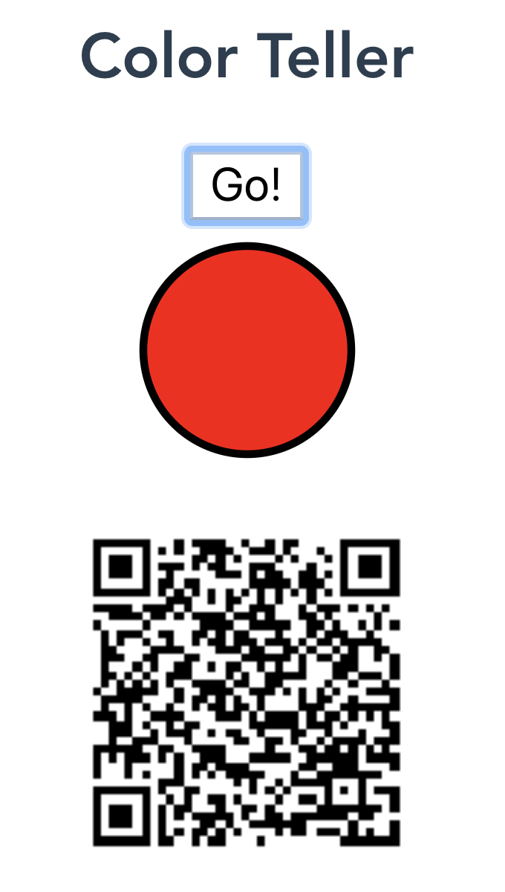
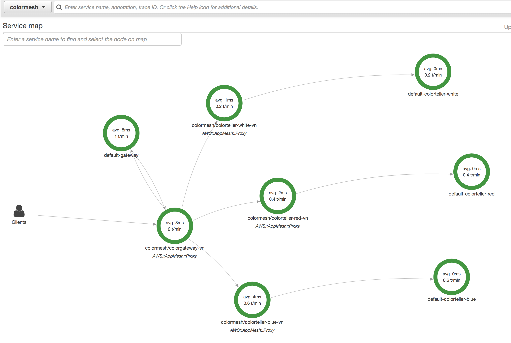

# ColorTeller - AppMesh, X-Ray + Fargate Demo using AWS CDK

This demo uses AWS CDK.
you need to run `cdk bootstrap` as the CFN template generated (synthesized) is more than 2000 lines, compared to ~ 400+ LOC for TypeScript! 


PS: colorteller, appmesh envoy Docker images are hosted on dockerhub for now.

## Quick start (in AWS Cloud9 or anywhere)

```
nvm install 8.14.0
nvm alias default v8.14.0
npm i -g aws-cdk@0.28.0
npm install
npm run build
cdk bootstrap
cdk deploy
```
this will deploy AWS Fargate/AppMesh/Frontend code as container, but we need to update vuejs container with the newly create ALB endpoint.
```
vi vueapp/src/App.vue # edit line 27 and assign the ALB DNS Name to "inputurl"
npm run build
cdk deploy
```

Once fully deployed, go to the newly created ALB and access its ``/color`` endpoint multiple times. the json output should rotate the 3 colors evenly.
eg:
http://farga-exter-yt5qsba6l5n1-1671653105.ap-southeast-1.elb.amazonaws.com/color

Or  you can use the newly created Vuejs frontend at:
http://ALBDNS/app/



## Change the routing weights to the colorteller backend
you can change the current 1:1:1 weight of colorteller routes to show appmesh traffic shaping feature.

https://ap-southeast-1.console.aws.amazon.com/appmesh/meshes/colormesh/virtual-routers/colorteller-vr

## AWS X-Ray
In AWS Xray console, choose “Create group”, name the group “color”, and enter the expression that filters all the ``/color`` requests.

```
(service("colormesh/colorgateway-vn")) AND http.url ENDSWITH "/color"
```




Refer to this blog post for more info:
https://medium.com/containers-on-aws/aws-app-mesh-walkthrough-deploy-the-color-app-on-amazon-ecs-de3452846e9d

